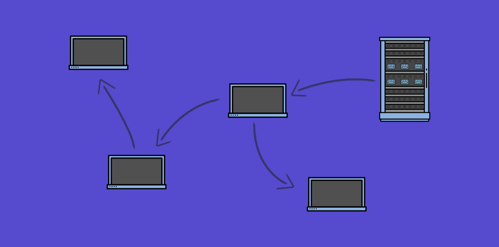

# Peer-to-Peer content delivery

A Peer-to-peer (P2P) demo for delivering content via WebRTC.

[Medium post](https://medium.com/@maxvanderschee/the-power-of-peer-to-peer-right-in-your-browser-16fbeff0d44d)

[Demo](https://demo.dev-attic.com/peer-to-peer-web-content/index.html)

## Credits

- [normalize](github.com/necolas/normalize.css) by Nicolas Gallagher
- [Scaledrone](https://www.scaledrone.com/) by Scaledrone

## License
This resource can be used freely if integrated or build upon in personal or commercial projects such as websites, web apps and web templates intended for sale. It is not allowed to take the resource "as-is" and sell it, redistribute, re-publish it, or sell "pluginized" versions of it. Free plugins built using this resource should have a visible mention and link to the original work. Always consider the licenses of all included libraries, scripts and images used.

## Misc

Follow Me: [Medium](https://medium.com/@maxvanderschee), [GitHub](https://github.com/mvdschee), [Twitter](https://twitter.com/maxvanderschee)

[© Max van der Schee 2018](https://maxvanderschee.nl)

